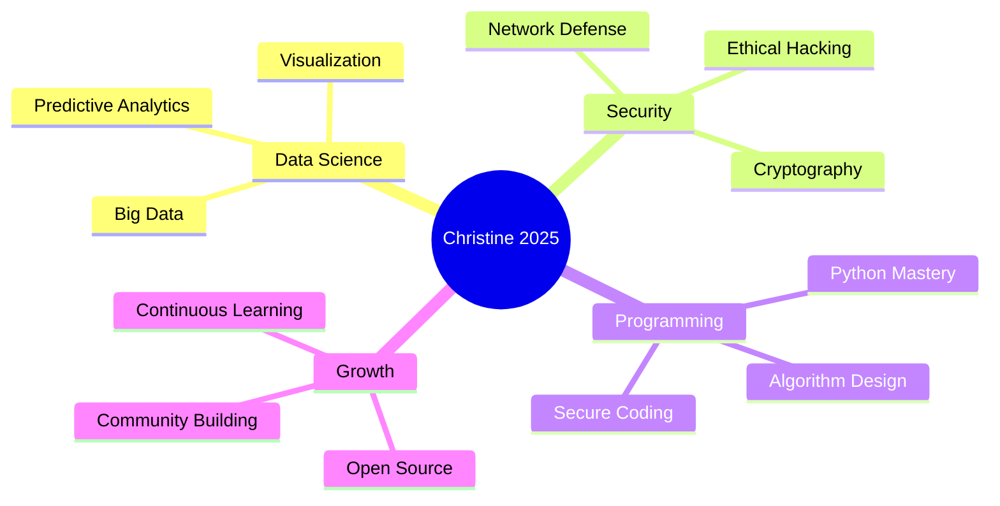

<!-- 🌍 Ultra-Modern Animated GitHub Profile -->
<!-- 🎨 HERO BANNER WITH CUSTOM GRADIENT -->
<div align="center">
  
</div>

<!-- 🎭 DYNAMIC TYPING ANIMATION (FIXED) -->
<div align="center">
  
</div>

<div align="center">
  
  ✨ **Welcome to my digital space** ✨
  
</div>

---

<!-- 🎯 MODERN PROFILE CARDS SECTION -->
<div align="center">

## 🌟 **WHO AM I?**

</div>

<table align="center" width="100%">
<tr>
<td width="50%" valign="top">

### 👨‍💻 **The Developer**

```python
class NamatovuChristine:
    def __init__(self):
        self.name = "Namatovu Christine"
        self.role = "Data Scientist & Security Specialist"
        self.location = "Global 🌍"
        self.education = "Lifelong Learner"
        self.languages = ["Python", "R", "SQL", "C++", "Java", "JavaScript"]
        self.focus = ["Cybersecurity", "Data Analysis", "Machine Learning"]
        
    def current_mission(self):
        return {
            "Protecting": "Digital Assets",
            "Analyzing": "Complex Datasets",
            "Building": "Secure Solutions"
        }
    
    def motto(self):
        return "Data drives decisions, Security protects them."
```

</td>
<td width="50%" valign="top">

### 🎯 **Quick Facts**

| 📊 | Detail |
|---|---|
| 🎓 | Computer Science @ MUST |
| 💼 | AI, Mobile Dev, IoT |
| 🌱 | Deep Learning, TensorFlow, Edge AI |
| 💡 | Innovation, Problem-Solving, Tech for Good |
| 🎵 | Coding, Learning, Building |
| ☕ | Coffee + Code + Curiosity |
| 🌍 | Tech Solutions for Africa |
| ⚡ | I debug with optimism! |

</td>
</tr>
</table>

---

<!-- 💼 TECH STACK - ENHANCED -->
<div align="center">

## ⚡ **TECH STACK**

### 🔐 **Security & Data Science**


### 💻 **Languages & Development**


### 🛠️ **Tools & Platforms**


### 📊 **Data & Databases**


</div>

---

<!-- 🚀 FEATURED PROJECTS SECTION -->
<div align="center">

## 🚀 **FEATURED PROJECTS**

*Innovative solutions built with passion and precision*

</div>

<table align="center" width="100%">
<tr>
<td width="50%" valign="top" align="center">

### 🔐 Security & Operations


**Network Security & Data Protection**

🛡️ Secure systems design  
🔍 Vulnerability assessment  
🔐 Cryptography implementation  
🌐 Network defense strategies

</td>
<td width="50%" valign="top" align="center">

### 📊 Data Science Analytics


**Insight Generation System**

📈 Predictive Analytics  
🤖 Machine Learning Models  
📉 Data Visualization  
🧮 Statistical Analysis

</td>
</tr>
<tr>
<td width="50%" valign="top" align="center">

### 🌐 Web Development


**Secure Web Applications**

💻 Responsive design  
🔒 Security-first approach  
⚡ Performance optimization  
🎨 Modern UI/UX

</td>
<td width="50%" valign="top" align="center">

### 📱 Mobile Development


**Cross-Platform Solutions**

📲 Flutter development  
🎯 User-centric design  
🔄 Real-time features  
📊 Data integration

</td>
</tr>
</table>

<div align="center">

<a href="https://github.com/NAMATOVU-CHRISTINE?tab=repositories">
  
</a>

</div>

---

<!-- 📊 ADVANCED GITHUB STATISTICS -->
<div align="center">

## 📊 **GITHUB ANALYTICS**

*My contributions and coding journey*

</div>

<p align="center">
  
  
</p>

<p align="center">
  
</p>

<p align="center">
  
  
</p>

---

<!-- 🏆 ACHIEVEMENTS & TROPHIES -->
<div align="center">

## 🏆 **ACHIEVEMENTS & MILESTONES**

*Celebrating my journey and accomplishments*


</div>

<div align="center">

### 📈 **Contribution Stats**


### 🎯 **GitHub Metrics**


</div>

---

<!-- 🎯 CURRENT FOCUS & ROADMAP -->
<div align="center">

## 🎯 **CURRENT FOCUS & 2025 ROADMAP**

*My strategic vision for growth and innovation*

</div>



---

<!-- 💡 SKILLS PROGRESS BARS -->
<div align="center">

## 💡 **SKILL PROGRESSION**

*Continuous learning and mastery*

</div>

<table align="center">
<tr>
<td align="center" width="50%">

| Skill | Progress |
|---|---|
| 🤖 Artificial Intelligence |  |
| 🔐 Cybersecurity |  |
| 📊 Data Science |  |

</td>
<td align="center" width="50%">

| Skill | Progress |
|---|---|
| 📱 Mobile Development |  |
| 🌐 Web Development |  |
| ☁️ Cloud & DevOps |  |

</td>
</tr>
</table>

---

<!-- 🌐 SOCIAL LINKS WITH CUSTOM STYLING -->
<div align="center">

## 🌐 **LET'S CONNECT!**

*Reach out and let's build something secure and insightful together*

<a href="https://github.com/NAMATOVU-CHRISTINE">
  
</a>
<a href="https://www.linkedin.com/in/amanya-micheal-778a9234a">
  
</a>
<a href="mailto:amanyamicheal770@gmail.com">
  
</a>

### 📊 **Coding Activity**

<!--START_SECTION:waka-->
<!--END_SECTION:waka-->

</div>

---

<!-- 📚 LATEST BLOG POSTS & ACTIVITY -->
<div align="center">

## 📚 **LATEST UPDATES**

*Insights and knowledge from my tech journey*

<!-- BLOG-POST-LIST:START -->
- 🔐 [The Importance of Data Security in 2025](#)
- 📊 [Data Science: From Raw Data to Insights](#)
- 🧠 [Understanding Cybersecurity Threats](#)
<!-- BLOG-POST-LIST:END -->

</div>

---

<div align="center">

## 🔥 **RECENT GITHUB ACTIVITY**

<!--RECENT_ACTIVITY:start-->
<!--RECENT_ACTIVITY:end-->

</div>

---

<!-- 🐍 CONTRIBUTION SNAKE (FIXED) -->
<div align="center">

## 🐍 **CONTRIBUTION ACTIVITY**

*Watch me code - one commit at a time*

<picture>
  <source media="(prefers-color-scheme: dark)" srcset="https://github.com/NAMATOVU-CHRISTINE/NAMATOVU-CHRISTINE/blob/output/github-contribution-grid-snake-dark.svg?raw=true">
  <source media="(prefers-color-scheme: light)" srcset="https://github.com/NAMATOVU-CHRISTINE/NAMATOVU-CHRISTINE/blob/output/github-contribution-grid-snake.svg?raw=true">
  
</picture>

</div>

---

<!-- 📈 VISITOR COUNTER & STATS -->
<div align="center">

## 📈 **PROFILE INSIGHTS**


</div>

---

<!-- 💭 INSPIRATIONAL QUOTE -->
<div align="center">

## 💭 **QUOTE OF THE DAY**


</div>

---

<!-- 🎵 PERSONAL PHILOSOPHY -->
<div align="center">

## 🎵 **MY PHILOSOPHY**

> *"Security is not a product, but a process. Data is the key to understanding that process."*

**— Namatovu Christine** ✨

---

### ⭐ **Fun Facts About Me**

| 🌅 | Early Bird | Best code is written at dawn |
|---|---|---|
| 🎮 | Tech Gamer | I debug like it's a quest |
| 📚 | Lifelong Learner | Always exploring new tech |
| ☕ | Coffee Enthusiast | Powered by caffeine & curiosity |
| 🌍 | African Innovator | Building tech that solves real problems |
| 🚀 | Dream Big | The next big thing starts with small commits |

</div>

---

<!-- 🤝 COLLABORATION SECTION -->
<div align="center">

## 🤝 **OPEN FOR COLLABORATION**

*Let's create something extraordinary together!*

🚀 **AI/ML Projects** | 📱 **Mobile Applications** | 🌍 **Tech for Social Good** | 💡 **Open Source Initiatives**

<br/>

💌 **DM me on [LinkedIn](https://www.linkedin.com/in/amanya-micheal-778a9234a) or email at amanyamicheal770@gmail.com**

</div>

---

<!-- 🎯 SUPPORT SECTION -->
<div align="center">

## ☕ **SUPPORT MY WORK**

*If you find my projects helpful, consider supporting me!*

<a href="https://www.buymeacoffee.com/amanyamicheal">
  
</a>
<a href="https://ko-fi.com/amanyamicheal">
  
</a>

</div>

---

<!-- 📜 FOOTER WITH GRADIENT -->
<div align="center">


**⭐ Star my repositories if you find them useful!**

**💻 Happy Coding! | 🚀 Keep Building! | 🌍 Let's Change the World!**


---

*Last Updated: 2025 | Made with 💜 by Namatovu Christine*

</div>
